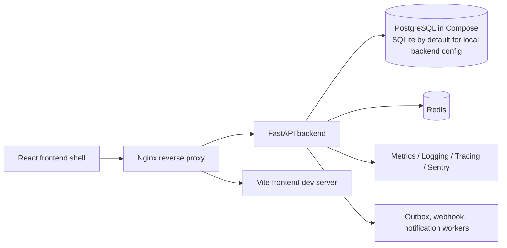

# TaskMaster

TaskMaster is a modular-monolith task tracking platform under active implementation from a BMAD planning baseline. The repository currently contains a working backend API foundation, a frontend navigation shell, Docker-based local runtime wiring, production-readiness checks, and supporting validation workflows through `TM-100`.

This README is intentionally split between what is implemented now and what remains planned. If the code and this document disagree, treat the repository implementation as the source of truth.

## Current Status

### Implemented through TM-100

- FastAPI backend with versioned API routing under `/api/v1`
- SQLAlchemy and Alembic-backed domain model foundations
- Health endpoint at `/api/v1/health`
- Prometheus metrics endpoint at `/metrics`
- Structured logging, correlation ID propagation, OpenTelemetry tracing, and Sentry wiring
- Auth endpoint contracts for login, refresh, and logout
- RBAC evaluator and authorization dependency infrastructure
- Project/workspace navigation endpoints for local frontend routing
- Work item create, list, detail, update, and transition APIs
- Workflow state catalog endpoint for board rendering
- Audit log and outbox/event write-path support
- Collaboration comment support
- Attachment upload metadata endpoint
- Notification list/read endpoints
- API token management endpoints
- Webhook management, signing, and delivery worker foundations
- WebSocket authentication handshake and Redis fanout foundations
- React frontend shell for login, workspace, project, work item list, board, and detail routes
- Docker Compose runtime with backend, frontend, PostgreSQL, Redis, and Nginx
- GitHub Actions validation and security scanning workflows
- Repository smoke tests for production-readiness surfaces

### Planned or intentionally incomplete

- Real credential verification and token issuance for login
- Refresh token rotation and logout revocation behavior
- Full frontend authenticated session handling
- Backend-enforced workspace/project membership scoping for local navigation endpoints
- Full persistence and UI workflows for labels, components, and versions
- Rich frontend collaboration, activity, attachment, and notification experiences
- Production deployment automation, dashboards, and Kubernetes runtime

## Feature Overview

### Backend capabilities implemented now

- Identity and access foundations:
  auth route contracts, JWT utilities, password hashing, refresh token and API token models, RBAC evaluator, authorization dependency hooks
- Project and workflow foundations:
  workspace and project navigation endpoints, workflow state catalog endpoint, workflow models and validators
- Work item management:
  create, list, detail, update, and transition APIs with audit and event hooks
- Collaboration and attachments:
  comment creation plus attachment upload metadata contract
- Notifications and realtime:
  notification list/read endpoints, WebSocket auth handshake, Redis fanout adapter, notification dispatcher foundation
- Integrations:
  webhook endpoint management, webhook signing, and delivery worker support
- Production readiness:
  health, metrics, logging, tracing, Sentry, rate limiting, Docker health checks, CI validation, dependency scanning, smoke tests

### Frontend capabilities implemented now

- Login page shell that documents the backend-owned auth contract
- Workspace and project navigation shell
- Project shell with route-aware links into work item views
- Work item list page that renders the backend list contract
- Work item detail page that renders detail and transition contract surfaces
- Board page that uses backend workflow-state and transition APIs rather than inferring workflow rules in the browser
- Frontend Sentry initialization and error boundary

### Frontend behavior intentionally limited today

- The frontend does not invent permissions, membership scope, workflow legality, or persisted fake data
- Several pages are contract-driven shells that explain what the backend must provide, rather than complete product workflows
- The login route is present, but real authentication is not yet enabled end to end

## Architecture Overview

TaskMaster currently follows the planning baseline: a modular monolith where the backend owns workflow rules, authorization, audit behavior, and event dispatch policy, while the frontend remains presentation-oriented.



### Architectural characteristics

- Backend-first domain rules:
  authorization, workflow validation, audit logging, and event behavior live on the backend
- Presentation-only frontend:
  React pages render backend contracts and avoid local policy inference
- Generic work item domain:
  work items are modeled as one typed system rather than separate subsystems per item type
- Operational foundations included in core paths:
  logging, tracing, metrics, correlation IDs, Sentry strategy, and smoke validation are already wired in

## Technology Stack

### Backend

- Python 3.11+ in CI, Python 3.13 base image in Docker
- FastAPI
- SQLAlchemy
- Alembic
- PyJWT
- Prometheus Python client
- OpenTelemetry
- Sentry SDK
- Pytest, MyPy, Ruff

### Frontend

- Node.js 20 in CI and Docker
- React 18
- React Router
- Vite
- TypeScript
- ESLint
- Playwright
- Sentry React SDK

### Platform and tooling

- Docker Compose
- PostgreSQL 16
- Redis 7
- Nginx
- GitHub Actions
- `pip-audit`
- `npm audit`
- `gitleaks`

## Repository Structure

```text
.
├── apps/
│   ├── backend/      # FastAPI app, domain modules, backend tests, Dockerfile
│   └── frontend/     # React app, frontend tests, Playwright config, Dockerfile
├── tests/
│   └── smoke/        # Repository-level production readiness smoke tests
├── migrations/       # Alembic migrations
├── infra/
│   └── nginx/        # Reverse proxy config for Compose runtime
├── .github/workflows/# CI and validation workflows
├── _bmad-output/     # Planning and implementation artifacts
└── docs/             # Additional project documentation
```

### Backend module map

- `api/`: platform routes such as health and metrics wiring
- `identity/`: auth contracts, RBAC, API tokens, dependencies, security helpers
- `projects/`: workspace/project navigation, project metadata, workflow-state catalog
- `work_items/`: work item models, repository, routes, schemas
- `workflows/`: workflow definitions, states, rules, validators
- `audit/`, `activity/`, `workers/`: audit and outbox/event foundations
- `collaboration/`, `attachments/`, `notifications/`, `realtime/`, `integrations/`: collaboration, realtime, and integration surfaces
- `core/`: config, logging, tracing, metrics, Sentry, rate limiting

## Local Development Setup

### Prerequisites

- Python 3.11 or newer
- Node.js 20 or newer
- Docker and Docker Compose

### Clone and install

Backend:

```bash
cd apps/backend
python -m venv .venv
source .venv/bin/activate
python -m pip install --upgrade pip
python -m pip install --editable ".[dev]"
```

Frontend:

```bash
cd apps/frontend
npm ci
```

### Optional environment variables

Backend settings read from environment and currently default to local-safe values if unset.

- `TASKMASTER_DATABASE_URL`
- `TASKMASTER_JWT_SECRET`
- `TASKMASTER_JWT_ALGORITHM`
- `TASKMASTER_JWT_ISSUER`
- `TASKMASTER_JWT_AUDIENCE`
- `TASKMASTER_JWT_ACCESS_TOKEN_TTL_SECONDS`
- `SENTRY_DSN`
- `SENTRY_ENVIRONMENT`
- `SENTRY_RELEASE`

Frontend observability reads:

- `VITE_SENTRY_DSN`

## Running the Backend

From `apps/backend`:

```bash
source .venv/bin/activate
python -m uvicorn taskmaster_backend.main:app --reload --host 127.0.0.1 --port 8000
```

Key backend URLs:

- Health: `http://127.0.0.1:8000/api/v1/health`
- Metrics: `http://127.0.0.1:8000/metrics`

### Database notes

- The backend config defaults to SQLite for local direct runs: `sqlite+pysqlite:///./taskmaster.db`
- Compose uses PostgreSQL instead
- Alembic migrations live under the repository root `migrations/`

Example migration commands from the repository root with the backend virtual environment active:

```bash
python -m alembic upgrade head
python -m alembic downgrade base
```

## Running the Frontend

From `apps/frontend`:

```bash
npm run dev -- --host 127.0.0.1 --port 5173
```

Open:

- Frontend app: `http://127.0.0.1:5173`

Important current routes:

- `/login`
- `/workspace`
- `/workspace/:workspaceId/projects/:projectId`
- `/workspace/:workspaceId/projects/:projectId/work-items`
- `/workspace/:workspaceId/projects/:projectId/board`
- `/workspace/:workspaceId/projects/:projectId/work-items/:workItemId`

## Docker Usage

The Compose stack is the easiest way to boot the repository’s full local runtime.

```bash
docker compose up --build
```

Services exposed by default:

- Backend: `http://127.0.0.1:8000`
- Frontend: `http://127.0.0.1:5173`
- Nginx: `http://127.0.0.1:8080`
- PostgreSQL: `127.0.0.1:5432`
- Redis: `127.0.0.1:6379`

### Compose behavior

- `backend` health check calls `/api/v1/health`
- `frontend` health check verifies the Vite server responds on port `5173`
- `nginx` proxies `/api/` and `/ws/` to the backend and `/` to the frontend
- `postgres` and `redis` both include container health checks

Useful commands:

```bash
docker compose config
docker compose up -d
docker compose ps
docker compose down
```

## Testing Strategy

Testing is split by application boundary and by production-readiness coverage.

### Backend

From `apps/backend`:

```bash
ruff check .
mypy .
pytest
```

Backend tests cover:

- domain models and migrations
- auth contracts and security helpers
- work item APIs and workflow transitions
- audit and event behavior
- integrations, notifications, realtime, and observability contracts

### Frontend

From `apps/frontend`:

```bash
npm run lint
npm run typecheck
npm run test
npx playwright test
npm run build
```

Frontend tests cover:

- route shells and contract rendering
- board, list, detail, and navigation behavior
- end-to-end smoke/lifecycle checks through Playwright

### Repository smoke tests

The repo-level smoke suite verifies production-readiness surfaces only:

- backend health endpoint
- backend metrics endpoint
- frontend build
- `docker compose config`
- CI workflow presence

Run from the repository root with a Python environment that has backend dev dependencies installed:

```bash
python -m pytest tests/smoke
```

## CI/CD Workflows

The repository currently implements CI validation and security scanning workflows. It does not yet implement deployment automation or artifact publishing.

### `ci`

File: `.github/workflows/ci.yml`

Triggers:

- push to `main` or `revamp`
- pull requests targeting `main` or `revamp`
- manual `workflow_dispatch`

Jobs:

- `backend-validation`
  runs `ruff check .`, `mypy .`, and `pytest` in `apps/backend`
- `frontend-validation`
  runs `npm ci`, `npm run lint`, `npm run typecheck`, `npm run test`, and `npm run build` in `apps/frontend`

Manual trigger:

```bash
gh workflow run ci
```

### `validation`

File: `.github/workflows/validation.yml`

Triggers:

- push to `main` or `revamp`
- pull requests targeting `main` or `revamp`
- manual `workflow_dispatch`

Checks:

- `pip-audit` against the installed backend environment
- `npm audit --audit-level=high` in the frontend
- `gitleaks` secret scanning with `.gitleaks.toml`

Manual trigger:

```bash
gh workflow run validation
```

## Observability

Observability is already wired into the backend request path and the frontend shell.

### Backend

- Prometheus metrics at `/metrics`
- structured request logs with method, route template, status, latency, and correlation ID
- `X-Correlation-ID` response header propagation
- OpenTelemetry tracing for HTTP requests
- Sentry initialization through `SENTRY_DSN`
- Sentry redaction policy that strips secrets and PII-oriented fields

### Frontend

- Sentry initialization through `VITE_SENTRY_DSN`
- frontend error boundary with sanitized fallback messaging
- capture path for server-side `5xx` responses
- redaction of sensitive fields before events are sent

## Security Controls

Implemented controls in the repository today include:

- backend-owned authorization design
- RBAC permission evaluator and authorization dependencies
- auth endpoint rate limiting middleware for login and refresh flows
- correlation IDs on API responses and logs
- no default PII submission in backend or frontend Sentry integrations
- secret/credential redaction in observability payloads
- refresh token and API token hashed-at-rest models
- webhook signing support
- WebSocket bearer-token handshake contract
- dependency and secret scanning in GitHub Actions
- security headers in Nginx:
  `X-Content-Type-Options`, `X-Frame-Options`, and `Referrer-Policy`

### Important security caveat

Authentication endpoints are currently contract surfaces that return `501 Not Implemented`. The repository contains security primitives and scaffolding, but not a completed end-to-end authentication system yet.

## Known Limitations

- Login, refresh, and logout are defined but intentionally not implemented end to end
- The frontend remains partially contract-driven and is not yet a full production UI
- Workspace and project navigation endpoints are for local/manual navigation and do not yet enforce final membership-based scoping
- Some project metadata surfaces return explicit “not implemented yet” responses
- Docker Compose is the local runtime baseline; deployment automation is not yet present
- Repository-level smoke tests depend on a Python environment with backend test dependencies installed

## Future Roadmap Guidance

When extending the repository after `TM-100`, keep these directions intact:

- complete real authentication and refresh-token lifecycle behavior
- replace local-navigation shortcuts with backend-enforced membership-aware scoping
- continue filling out project metadata, collaboration, notification, and attachment workflows
- deepen realtime delivery from handshake-only foundations into richer subscriptions
- add deployment automation and environment-specific delivery workflows
- add dashboards and downstream observability sinks beyond current instrumentation baselines

## Implemented vs Planned Quick Reference

| Area | Implemented now | Planned / not finished |
| --- | --- | --- |
| Backend platform | FastAPI app, health, metrics, logging, tracing, Sentry, rate limiting | Deployment/runtime automation beyond Compose |
| Identity | Contracts, JWT/password/token primitives, RBAC, API token APIs | Real login, refresh rotation, logout revocation |
| Projects | Workspace/project navigation, workflow-state catalog | Final scoped navigation and complete metadata persistence |
| Work items | Create, list, detail, update, transition | Richer surrounding UX and downstream automation |
| Frontend | Shell routes, board/list/detail views, Sentry error boundary | Full authenticated app experience |
| Security workflows | CI validation, dependency audit, secret scan | Broader production hardening and operations rollout |
