# System Context and Architecture Overview
> Project: TaskMaster  
> Classification: Internal planning artifact  
> Scope: Enterprise SaaS planning, architecture, workflow, validation, and production readiness  
> Implementation code: intentionally excluded

## System Context
TaskMaster serves authenticated users through a React frontend and external clients through REST APIs. Backend services coordinate PostgreSQL, Redis, object storage, WebSocket channels, background workers, observability systems, and external integrations.

```mermaid
flowchart LR
  User[Users] --> FE[React Frontend]
  External[External API Clients] --> API[FastAPI Backend]
  FE --> API
  API --> PG[(PostgreSQL)]
  API --> Redis[(Redis)]
  API --> S3[(S3-compatible Storage)]
  API --> WS[WebSocket Gateway]
  API --> Outbox[(Event Outbox)]
  Worker[Background Workers] --> Outbox
  Worker --> Webhooks[External Webhooks]
  API --> OTel[OpenTelemetry]
  API --> Sentry[Sentry]
  API --> Logs[Loki]
  API --> Metrics[Prometheus]
```

## Deployment Baseline
Initial deployment uses Docker Compose behind Nginx and is compatible with Cloudflare Tunnel. The architecture must not assume direct public IP exposure.

## Runtime Components
- Nginx reverse proxy for frontend/backend routing and TLS termination if applicable.
- FastAPI backend for REST and domain operations.
- PostgreSQL for relational source of truth.
- Redis for cache, rate limiting, job broker, websocket fanout.
- Background workers for webhooks, notifications, email, indexing, cleanup.
- S3-compatible storage for attachments.
- Observability stack: Prometheus, Grafana, Loki, OpenTelemetry, Sentry.

## System Invariants
- Backend is stateless except for durable database/object storage and Redis-backed ephemeral state.
- Any state-changing action must be authenticated, authorized, validated, audited, and evented.
- External integrations are eventually consistent and retried through background jobs.
- Frontend must remain replaceable by external API clients.

## Future Microservice Extraction Candidates
1. Notification service.
2. Webhook/integration service.
3. Audit/event service.
4. Search/indexing service.
5. AI intelligence service.

Extraction should happen only when scale or team boundaries justify it.
