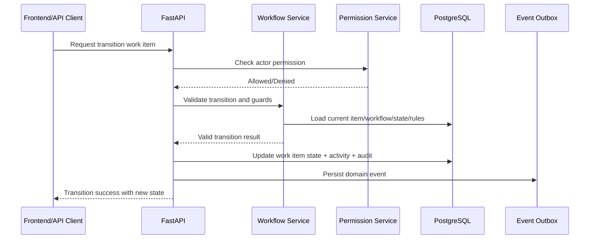

# Workflow Engine Design
> Project: TaskMaster  
> Classification: Internal planning artifact  
> Scope: Enterprise SaaS planning, architecture, workflow, validation, and production readiness  
> Implementation code: intentionally excluded

## Purpose
The workflow engine controls the lifecycle of work items. It prevents the common anti-pattern where status transitions become scattered across frontend code, database flags, and ad-hoc backend checks.

## Core Concepts

| Concept | Description |
|---|---|
| Workflow Definition | Named lifecycle model assigned to projects or work item types |
| State | A valid lifecycle state such as Backlog, In Progress, Review, Done |
| Transition | Directed movement from one state to another |
| Guard Rule | Condition that must pass before transition |
| Required Field Rule | Fields required before transition |
| Role Rule | Role or permission required for transition |
| Automation Trigger | Event emitted when transition occurs |

## Transition Flow

## Guard Rule Examples
- Only assignee can move a work item to `In Review`.
- Bug severity must be set before moving to `Ready for QA`.
- Incident must have resolution summary before moving to `Resolved`.
- Story must have acceptance criteria before moving to `Sprint Ready`.

## Initial Scope
The first version should support structured rule types, not arbitrary user-defined scripting. This avoids security risks and execution complexity.

Supported initial rules:
- Required fields.
- Allowed roles/permissions.
- Assignee/reporter constraints.
- Parent/child completion constraints.
- Comment required.

## Future Scope
- Visual workflow builder.
- Conditional automations.
- SLA timers.
- Scripted rules in sandboxed environment.
- AI-assisted workflow suggestions.

## Design Tradeoffs
- Storing workflow definitions in DB enables customization but requires strong migration/versioning strategy.
- Hardcoding workflows is simpler but blocks enterprise extensibility.
- Arbitrary scripts are powerful but unsafe initially.

## Non-Negotiable Rules
- Every transition is validated server-side.
- Every accepted transition writes audit history.
- Every transition emits an event.
- Frontend drag-and-drop is just a transition request, not a direct status update.
