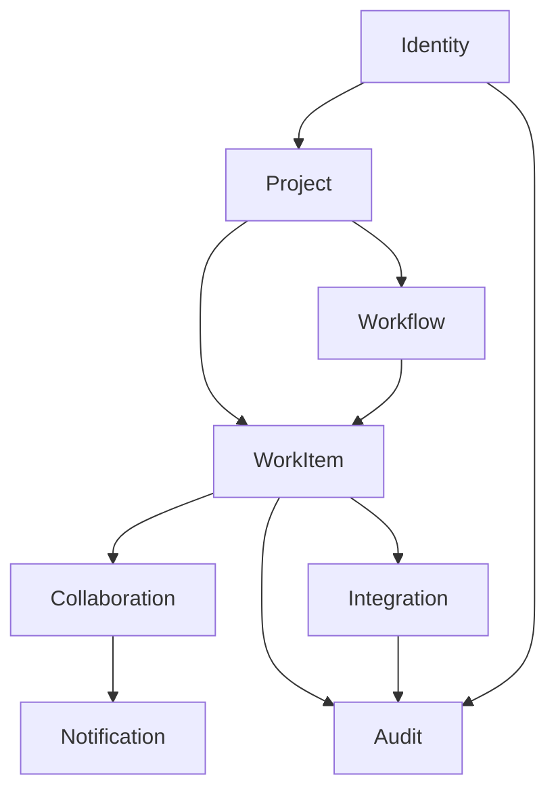

# Domain Models
> Project: TaskMaster  
> Classification: Internal planning artifact  
> Scope: Enterprise SaaS planning, architecture, workflow, validation, and production readiness  
> Implementation code: intentionally excluded

## Domain Boundary Map

## Identity Domain
Owns users, organizations, workspaces, memberships, roles, permissions, sessions, and API tokens. No other domain should directly decide whether an actor can perform a privileged action.

## Project Domain
Owns project containers and planning structures: boards, sprints, milestones, epics, labels, components, versions. It references workflows but does not implement workflow validation.

## Work Item Domain
Owns generic work item lifecycle, metadata, hierarchy, and relationships. Type-specific behavior must be expressed through typed metadata and workflow rules, not duplicated modules.

## Workflow Engine Domain
Owns lifecycle definitions, states, transitions, and guard rules. It validates transitions requested by Work Item domain services.

## Collaboration Domain
Owns comments, mentions, attachments, reactions, notifications, and user-visible activity feeds.

## Audit Domain
Owns immutable audit logs, security events, and entity versioning. Audit data must be queryable independently of user-facing activity feeds.

## Integration Domain
Owns webhooks, API tokens usage, external event handling, Git integration concepts, and third-party delivery logs.

## Domain Rules
- Domains interact through application services and explicit interfaces.
- Cross-domain database access must be controlled and intentional.
- Domain events are the preferred integration point for side effects.
- Future service extraction must not require changing domain vocabulary.
