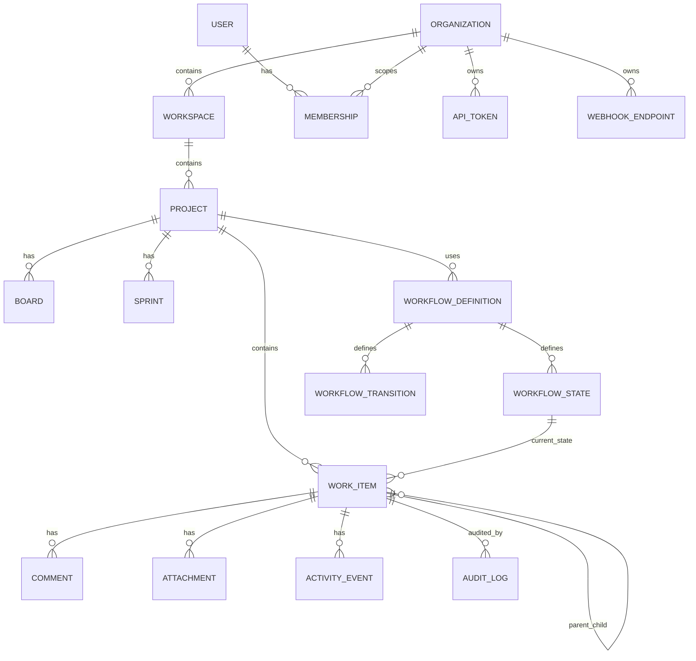

# Entity Relationships
> Project: TaskMaster  
> Classification: Internal planning artifact  
> Scope: Enterprise SaaS planning, architecture, workflow, validation, and production readiness  
> Implementation code: intentionally excluded

## High-Level ERD

## Relationship Design Notes
- Organization is the billing/security top-level boundary even if billing is deferred.
- Workspace is the collaboration boundary used by teams or clients.
- Project belongs to one workspace.
- Work item belongs to one project but can reference related work items.
- Subtasks are work items with a parent relation.
- Workflow definitions are versioned so existing items remain interpretable after workflow changes.
- Comments and activity are user-facing collaboration records; audit logs are compliance/security records.

## Entity Ownership

| Entity | Owning Domain |
|---|---|
| User | Identity |
| Organization | Identity |
| Workspace | Identity/Project boundary, identity owns access |
| Project | Project |
| WorkItem | Work Item |
| WorkflowDefinition | Workflow Engine |
| Comment | Collaboration |
| AuditLog | Audit |
| WebhookEndpoint | Integration |

## Data Integrity Constraints
- Work item state must belong to the workflow assigned to that item/project.
- Parent and child work items must belong to the same project in initial release.
- Comments require actor visibility on the target work item.
- Attachments require object storage reference plus DB metadata.
- API tokens must be revocable and scoped.
