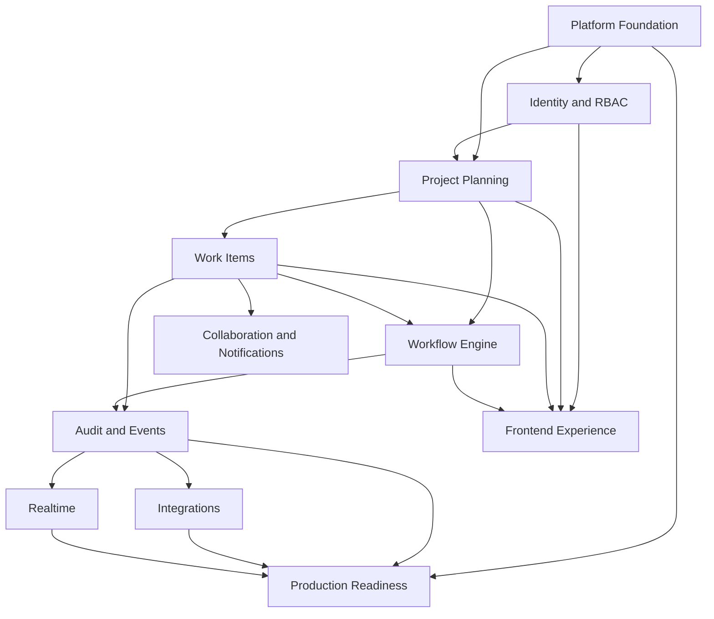

# Epic Dependency Graph
> Project: TaskMaster  
> Classification: Internal planning artifact  
> Scope: Enterprise SaaS planning, architecture, workflow, validation, and production readiness  
> Implementation code: intentionally excluded

## Critical Path
Platform Foundation -> Identity/RBAC -> Project -> Work Item -> Workflow Engine -> Audit/Event Outbox -> Collaboration/Realtime/Integrations -> Production Readiness.

## Parallelization Opportunities
- Frontend shell can begin after API contracts and auth contracts are stable.
- Project metadata models can run in parallel after project foundation.
- Audit model and event outbox can be built while collaboration model starts, after work item baseline.
- Observability middleware can begin early after backend skeleton.

## Blockers
- Work item transition endpoint depends on workflow validator.
- Board UI depends on work item list and transition APIs.
- Webhooks depend on event outbox.
- Notifications depend on comments/mentions and event dispatch.
- Production readiness depends on health checks, CI, observability, security gates.
