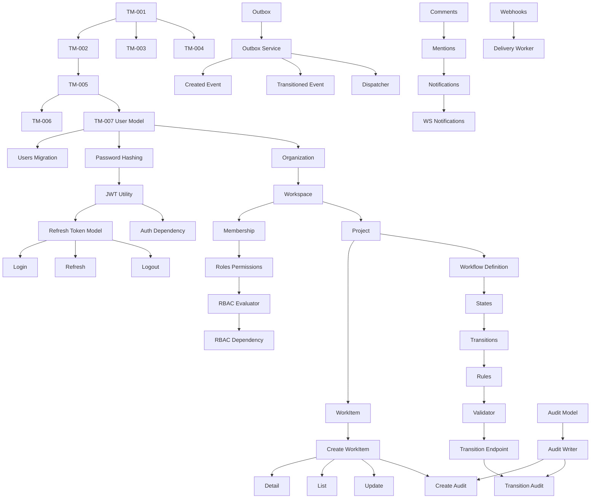

# Story Dependency Graph and Execution Ordering
> Project: TaskMaster  
> Classification: Internal planning artifact  
> Scope: Enterprise SaaS planning, architecture, workflow, validation, and production readiness  
> Implementation code: intentionally excluded

## Execution Waves

### Wave 0: Foundation
TM-001 to TM-006.

### Wave 1: Identity Foundation
TM-007 to TM-025.

### Wave 2: Project and Work Item Foundation
TM-026 to TM-041.

### Wave 3: Workflow Engine
TM-042 to TM-049.

### Wave 4: Audit, Events, Collaboration
TM-050 to TM-073.

### Wave 5: Integrations and Realtime
TM-074 to TM-083.

### Wave 6: Frontend Product Flows
TM-084 to TM-090.

### Wave 7: Observability, Security, CI, Smoke Tests
TM-091 to TM-100.

## Story Graph Snapshot

## Parallel Workstreams
- Workstream A: Identity and RBAC.
- Workstream B: Project metadata.
- Workstream C: Work item and workflow.
- Workstream D: Audit/events/collaboration.
- Workstream E: Frontend once contracts stabilize.
- Workstream F: Observability/security gates from early foundation onward.

## Merge Rule
Only merge stories that pass local validation and CI. Stories that alter contracts must update contract docs/tests in the same PR.
