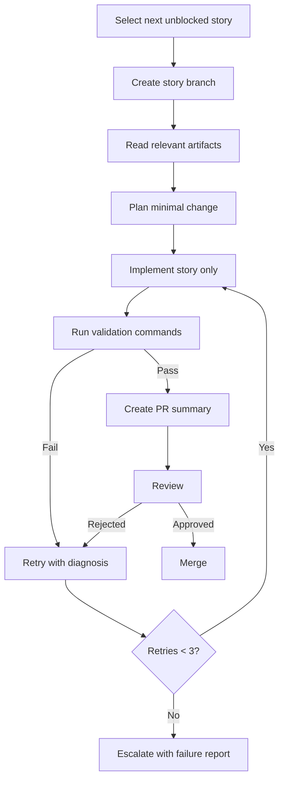

# Codex Execution Workflow
> Project: TaskMaster  
> Classification: Internal planning artifact  
> Scope: Enterprise SaaS planning, architecture, workflow, validation, and production readiness  
> Implementation code: intentionally excluded

## Operating Model
Codex executes exactly one story at a time. It must read the relevant planning artifacts, identify dependencies, implement only the story scope, run validation, and produce a reviewable PR summary.

## Story Execution Lifecycle

## Branching Strategy
- Branch format: `story/TM-###-short-title`.
- One story per branch.
- No mixed refactors unless the story explicitly requires it.
- Schema migrations must be clearly named and reversible where possible.

## PR Strategy
Each PR must include:
- Story id and title.
- Scope summary.
- Files changed by area.
- Validation commands and results.
- Tests added/updated.
- Risk assessment.
- Rollback notes.

## Retry Rules
- Maximum three implementation attempts per story.
- Attempt 1: direct implementation.
- Attempt 2: fix validation failures.
- Attempt 3: minimal rollback/rework based on root cause.
- After attempt 3, escalate instead of guessing.

## Escalation Rules
Escalate when:
- Architecture conflict exists.
- Requirements are ambiguous.
- Validation failure indicates upstream design issue.
- Security-sensitive behavior is unclear.
- Migration safety is questionable.

## Merge Rules
- No merge if validation fails.
- No merge if story scope expanded without approval.
- No merge if auth/RBAC tests are missing for protected endpoint changes.
- No merge if generated code or artifacts pollute repository.

## Rollback Handling
Small stories allow branch-level rollback. Migrations require explicit rollback assessment. Feature flags should be used for risky user-visible changes.
